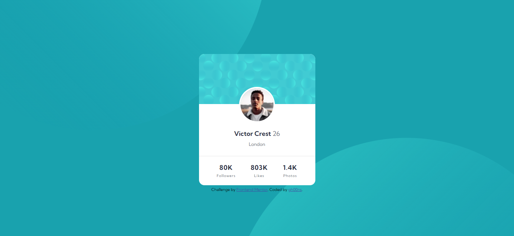

# Frontend Mentor - Profile card component solution

This is a solution to the [Profile card component challenge on Frontend Mentor](https://www.frontendmentor.io/challenges/profile-card-component-cfArpWshJ). Frontend Mentor challenges help you improve your coding skills by building realistic projects.

## Overview

Challenge #6

### The challenge

- Build out the project to the designs provided

### Screenshot

Mobile:

Desktop:

## Acknowledgments

Help of Mr. Coder's video on responsiveness between mobile/desktop: https://www.youtube.com/channel/UCsv_Hi2fnZ_FGG0rko1OzWg
